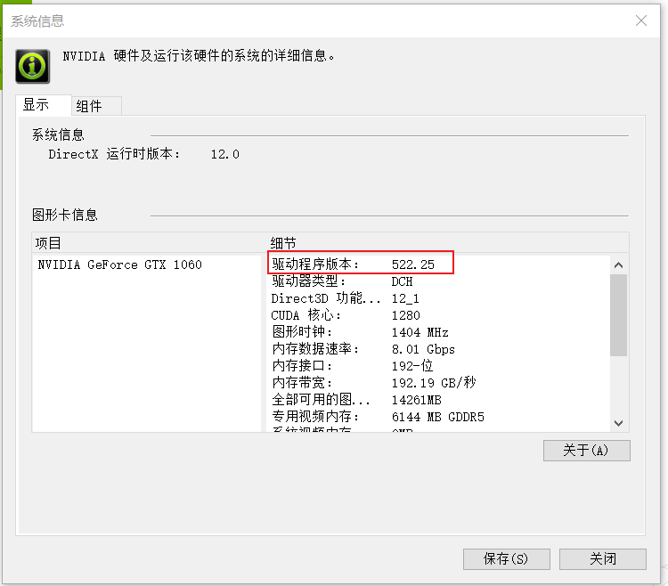
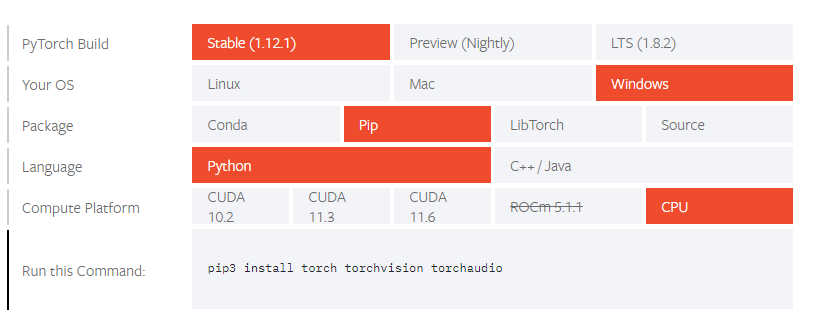
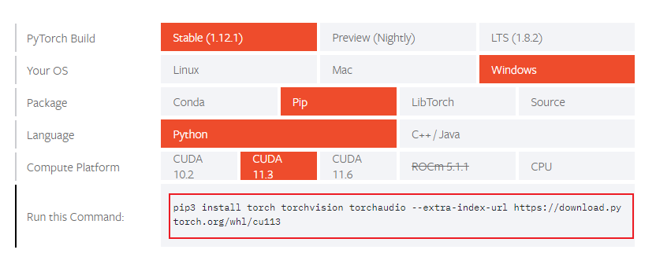

# Installing PyTorch on Windows 10

## 0. Prerequisites(optional)

### 0.1 CUDA version required

If your computer has a GPU, please visit the [PyTorch site](https://pytorch.org/get-started/locally/) to check which version of CUDA is required for the version of pytorch you want to install and make sure that your graphics card driver supports this version of CUDA. If not, update the graphics card driver.


As we can see,  **pytorch 1.12 requires CUDA 11.3**

### 0.2 Check CUDA version

- #### Open NVIDA Control Panel


- #### Check the NIVIDA driver information


- #### NIVIDA driver version




Here we can see that the highest supported version of CUDA for the driver is 11.8.

**Note: This indicates the highest supported version, and the driver is backward compatible with CUDA versions lower than 11.8.**

For more details  ,please visit this link: https://docs.nvidia.com/cuda/cuda-toolkit-release-notes/index.html


Here my computer's graphics card driver supports the version of pytorch-gpu we want to install. If yours does not, then please find a way to update your graphics card driver.

## 1. Installing PyTorch

We now go to the [PyTorch site](https://pytorch.org/get-started/locally/) (https://pytorch.org/get-started/locally/) and select the best configuration for our computer.

Select the relevant PyTorch installation details:

- PyTorch build – stable.
- Your OS – Windows
- Package – pip
- Language – Python
- Compute Platform – CPU, or choose your version of Cuda.

#### No CUDA



#### With CUDA



If you have a graphics card, select the **Compute Platform CUDA** configuration. If you do not have a dedicated GPU, select **Compute Platform CPU**.

Keep **Conda** as your Package Manager.

Once you have completed the various selections, copy the command that can be found under **Run this command**.

From the Windows menu, **run Anaconda Navigator** and then **launch the CMD.exe Prompt**.

In the window that opens, **paste the command copied earlier and execute it**. This will start the installation of PyTorch in our environment.

## 2. Checking the Setup

To ensure that PyTorch was installed correctly, we can verify the installation by running sample PyTorch code. Here we will construct a randomly initialized tensor.

From the command line, type:

```
python
```


then enter the following code:

```
import torch
x = torch.rand(5, 3)
print(x)
```


Additionally, to check if your GPU driver and CUDA is enabled and accessible by PyTorch, run the following commands to return whether or not the CUDA driver is enabled:

```
import torch
torch.cuda.is_available()
```


```
torch.version.cuda
```


## 3. Next Steps

[Pytorch tutorials ](https://pytorch.org/tutorials/)
