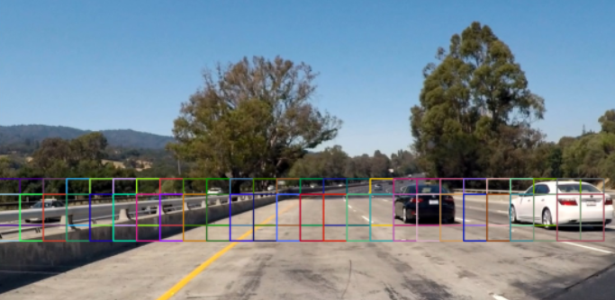
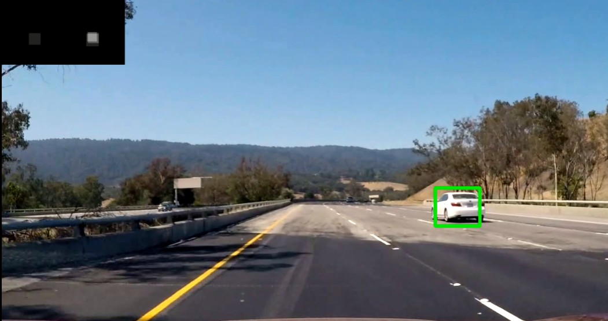

# Lab 10 Tutorial for Machine Learning

# Application: Vehicle Detection with HOG & SVM

> Based on the tutorial of "2021F Machine Learning" designed by teaching group in SUSTech
>
> Modified by JIA Yanhong in 2022. NOV. 10th

## Introduction

SVM is a widely used classifier. Even now, many machine learning jobs have been accomplished by using SVMs. Recently, neural networks have overtaken SVMs for most complex classification tasks. However, this does not mean that SVMs will not be used any more.

In this lab, the goal is to write a software pipeline to identify vehicles in a video and apply a tight bounding box around each detected vehicle. The following steps will be performed to achieve our goal:

- Feature extraction by **HOG** (Histogram of Oriented Gradients)
  - Apply HOG on dataset to extract features for SVM's training
  - Apply color transform, append binned color features and histograms of color to HOG feature vector
- Train **SVM** classifier used to detect vehicles
- Implement **sliding window** to extract parts of image which may contain a vehicle
- Run the pipeline on a video stream
  - Create *heat map* for each frame
  - Draw a bounding box for each detected vehicle

It doesn’t matter that you do not understand most terms above. We will provide a framework for implement SVM, all you need is to **all you need is tuning parameters and make the pipeline work well** . We expect that you can read the code through and figure out how the whole framework works.

---

Structure of this lab code:

- `experiment.py`: you can start the whole pipeline here
- `train.py`: train SVM here
- `descriptor.py`: feature extractor
- `detector.py`: load and write videos
- `slidingwindow.py`: sliding window

## Install libraries

This project uses other Python packages such as `OpenCV`,` scikit-image`. They should be correctly installed. For Anaconda user, here are the tips:

- Install `scikit-image`:

```
pip install  scikit-image
```

- install `opencv`

```
 pip install opencv-python
```

These packages are used to load data and extract features by HOG, you just need to use these features to train you SVM. Than you can use your classifier to detect vehicles in a test video which uses a sliding window method.

## Training datasets and test videos

We provide training datasets and test videos . Please download the from the following link:

> 链接：https://pan.baidu.com/s/1hNBQcwdkT4oqTjspGaabFA
> 提取码：csml

After downloading, unzip the samples.zip and videos.zip to the `Lab10.Assignment` folder.

## Feature Extraction by HOG

### HOG

Then you need to extract features by **HOG** which are then used to train SVM classifier.

The `descriptor` class in `descriptor.py` is used to extract HOG features which invokes `skimage.feature.hog()`. This method has many parameters, here are some of them:

- `pixels_per_cell`: number of pixels per cell, default value is (8,8) in this lab
- `cells_per_block`: number of cells per block, default value is (2,2) in this  lab
- `orientations`: number of orientations, default value is 9 in this lab

Not all parameters are useful for classification and too many cells will reduce computational speed.

`<font color=red>`You need to try different orientations to get the highest test set accuracy `</font>`.

### Color Space

There are many color spaces: `RGB`, `HSV`, `HLS`, `YUV`, `YCrCb` and `LUV`. Initially we use `ycrcb` and you need to try others and `<font color=red>`select a color space with the highest test set accuracy `</font>`.

## SVM Classifier

Before performing a SVM, `<font color=red>` you should standardize raw data, as SVM algorithm is based on distance and scale will influence the result `</font>`.

Then, you need to use SVM in scikit-learn library:

```python
from sklearn.svm import LinearSVC
"""
sklearn.svm.LinearSVC(penalty='l2', loss='squared_hinge', *, dual=True, tol=0.0001, C=1.0,multi_class='ovr', fit_intercept=True, intercept_scaling=1, class_weight=None, verbose=0, random_state=None, max_iter=1000)
"""
svc = LinearSVC(C=1e9)
svc.fit(X_train, y_train)

```

 It has several parameters, for instance

- `C`: regularization factor for soft SVM
- `penalty`: norm of penalization, like L1 and L2
- `loss`: loss function, including hinge and squared_hinge

## Sliding Window & Heat Map

### Sliding window

Now you have a classifier which can tell whether a image is a car, but there is another problem: we don't know where a car is in a big picture.

To solve this problem, here comes sliding window:

```python
def slidingWindow(image_size, init_size=(64, 64), x_overlap=0.5, y_step=0.05,
                  x_range=(0, 1), y_range=(0, 1), scale=1.5):
	windows = []
	h, w = image_size[1], image_size[0]
    for y in range(int(y_range[0] * h), int(y_range[1] * h), int(y_step * h)):
        win_width = int(init_size[0] + (scale * (y - (y_range[0] * h))))
        win_height = int(init_size[1] + (scale * (y - (y_range[0] * h))))
        if y + win_height > int(y_range[1] * h) or win_width > w:
            break
        x_step = int((1 - x_overlap) * win_width)
        for x in range(int(x_range[0] * w), int(x_range[1] * w), x_step):
            windows.append((x, y, x + win_width, y + win_height))
     return windows
```

Its main idea is to extract a small patch using a window from a big picture so you can apply your classifier to it. Implement here directly generates many windows in an area rather than sliding a single window. Pay attention that `<u>`the closer window is to camera, the bigger the window's size is `</u>`.

You can call `display_windows()` in `slidingwindow.py` to see these windows, they are like this:

<center> </center>

### Heat map

Heat map is to filter false positives by setting a threshold. You can see it at upper left corner in following picture.

<center> </center>

These are relative codes:

```python
# in detector.py
def detectVideo(...):
    ...
  
   	# if a window has a car, add 10 into corresponding position in heat map
    for (x_upper, y_upper, x_lower, y_lower) in self.classify(frame):
        current_heatmap[y_upper:y_lower, x_upper:x_lower] += 10
    ...
    # draw heat map
    if draw_heatmap:
        inset = cv2.resize(summed_heatmap, inset_size,
                           interpolation=cv2.INTER_AREA)
        inset = cv2.cvtColor(inset, cv2.COLOR_GRAY2BGR)
        frame[:inset_size[1], :inset_size[0], :] = inset
    ...
    # Ignore heatmap pixels below threshold.
    summed_heatmap[summed_heatmap <= threshold] = 0
    ...
```

## Lab Assignment

Please finish the **Exercise** and answer **Questions**.

### Exercise 1(100 points)

Please download the code and data,. You should **firstly train your SVM, then you need to adjust hyperparameters of HOG 、sliding window、SVM、Detector**.

You can test your code on *test_video.mp4*. If the detecting result is good enough, save it as *result_video.mp4*.

What you need to submit:

1. Files: *train.py*. *experiment.py*
2. Video: your detecting result video (*result_video.mp4*)

### Exercise 2 Questions(4 points)

1. Can SVM be used for unsupervised clustering or data dimension reduction? Why?
2. What are the strengths of SVMs; when do they perform well?
3. What are the weaknesses of SVMs; when do they perform poorly?
4. What makes SVMs a good candidate for the classification / regression problem, if you have enough knowledge about the data?
