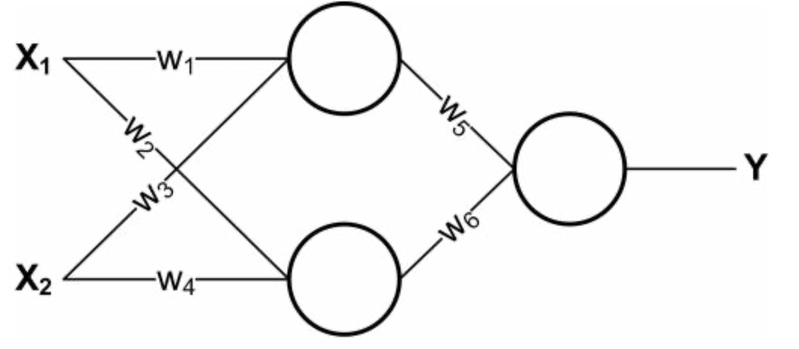

# CS405 Homework 5

*Course: Machine Learning(CS405) - Professor: Qi Hao*

## Question 1

Consider a regression problem involving multiple target variables in which it is assumed that the distribution of the targets, conditioned on the input vector x, is a Gaussian of the form

$$p(\mathbf{t|x,w}) = \mathcal N(\mathbf{t|y(x,w), \Sigma)}$$

where $\mathbf{y(x,w)}$ is the output of a neural network with input vector $\mathbf x$ and wight vector $\mathbf w$, and $\mathbf \Sigma$ is the covariance of the assumed Gaussian noise on the targets. 

(a) Given a set of independent observations of $\mathbf x$ and $\mathbf t$, write down the error function that must be minimized in order to find the maximum likelihood solution for $\mathbf w$, if we assume that $\mathbf \Sigma$ is fixed and known. 

(b) Now assume that $\mathbf \Sigma$ is also to be determined from the data, and write down an expression for the maximum likelihood solution for $\mathbf \Sigma$. (Note: The optimizations of $\mathbf w$ and $\mathbf \Sigma$ are now coupled.)

## Question 2

The error function for binary classification problems was derived for a network having a logistic-sigmoid output activation function, so that $0 \leq y(\mathbf{x,w}) \leq 1$, and data having target values $t \in \{0,1\}$. Derive the corresponding error function if we consider a network having an output $-1 \leq y(\mathbf{x,w}) \leq 1$ and target values $t = 1$ for class $\mathcal C_1$ and $t = -1$ for class $\mathcal C_2$. What would be the appropriate choice of output unit activation function? 

**Hint.** The error function is given by:

$$E(\mathbf w) = -\sum^N_{n=1}\{t_n\mathrm{ln}y_n + (1-t_n)\mathrm{ln}(1 - y_n)\}.$$

## Question 3

Verify the following results for the conditional mean and variance of the mixture density network model.

(a) $$\mathbb E[\mathbf{t|x}] = \int \mathbf tp(\mathbf{t|x})\mathrm d \mathbf t = \sum_{k=1}^{K} \pi_k(\mathbf x)\mu_k(\mathbf x).$$

(b) $$s^2(\mathbf x) = \sum^K_{k=1}\pi_k(\mathbf x)\{\sigma^2_k(\mathbf x) + \Arrowvert\mu_k(\mathbf x) - \sum^K_{l=1}\pi_l(\mathbf x)\mu_l(\mathbf x)\Arrowvert^2\}.$$

## Question 4

Can you represent the following boolean function with a single logistic threshold unit (i.e., a single unit from a neural network)? If yes, show the weights. If not, explain why not in 1-2 sentences. 

| A    | B    | f(A,B) |
| ---- | ---- | ------ |
| 1    | 1    | 0      |
| 0    | 0    | 0      |
| 1    | 0    | 1      |
| 0    | 1    | 0      |

## Question 5

Below is a diagram of a small convolutional neural network that converts a 13x13 image into 4 output values. The network has the following layers/operations from input to output: convolution with 3 filters, max pooling, ReLU, and finally a fully-connected layer. For this network we will not be using any bias/offset parameters (b). Please answer the following questions about this network. 

(a) How many weights in the convolutional layer do we need to learn?

(b) How many ReLU operations are performed on the forward pass? 

(c) How many weights do we need to learn for the entire network?

(d) True or false: A fully-connected neural network with the same size layers as the above network $(13\times13\rightarrow3\times10\times10\rightarrow3\times5\times5\rightarrow4\times1)$ can represent any classifier?

(e) What is the disadvantage of a fully-connected neural network compared to a convolutional neural network with the same size layers?

## Question 6

The neural networks shown in class used logistic units: that is, for a given unit $U$, if $A$ is the vector of activations of units that send their output to $U$, and $W$ is the weight vector corresponding to these outputs, then the activation of $U$ will be $(1+\exp(W^TA))^{-1}$. However, activation functions could be anything. In this exercise we will explore some others. Consider the following neural network, consisting of two input   units, a single hidden layer containing two units, and one output unit:

(a) Say that the network is using linear units: that is, defining $W$ and and $A$ as above, the output of a unit is $C*W^TA$ for some fixed constant $C$. Let the weight values $w_i$ be fixed. Re-design the neural network to compute the same function without using any hidden units. Express the new weights in terms of the old weights and the constant $C$. 

(b) Is it always possible to express a neural network made up of only linear units without a hidden layer? Give a one-sentence justification.

(c) Another common activation function is a theshold, where the activation is $t(W_TA)$ where $t(x)$ is 1 if $x > 0$ and 0 otherwise. Let the hidden units use sigmoid activation functions and let the output unit use a threshold activation function. Find weights which cause this network to compute the XOR of $X_1$ and $X_2$ for binary-valued $X_1$ and $X_2$. Keep in mind that there is no bias term for these units.

