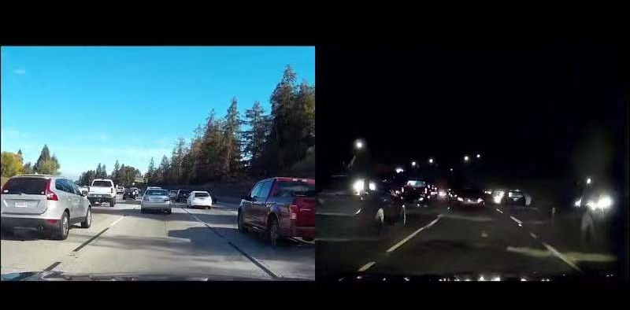
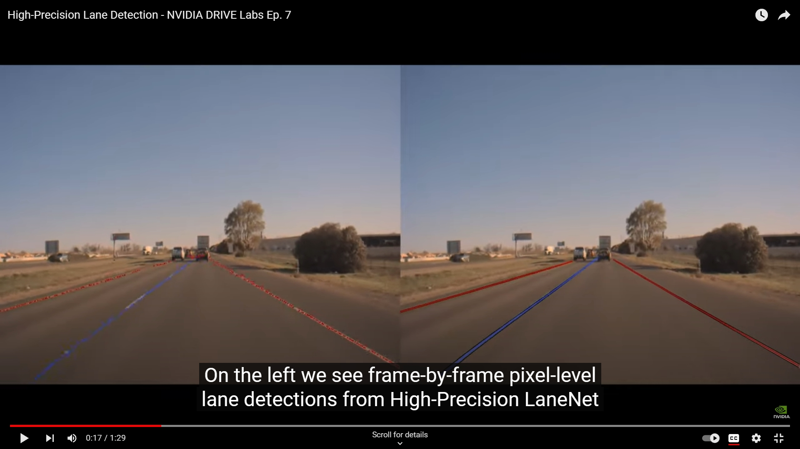
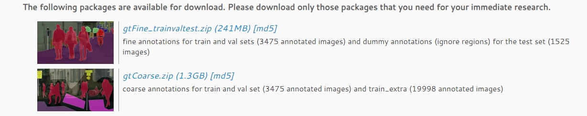

# Machine learning final project 2023

In this project, please choose **ONE** of the following eight jobs (choosing more than one job will **NOT** give you more score):

 + [1. Object detection and tracking](#1-object-detection-and-tracking)
 + [2. GAN for self-driving data augmentation](#2-gan-for-self-driving-data-augmentation)
 + [3. CARLA Simulator](#3-carla-simulator)
 + [4. Traffic-Sign Detection and Recognition](#4-traffic-sign-detection-and-recognition)
 + [5. Lane Detection](#5-lane-detection)
 + [6. Vehicle road cooperative](#6-vehicle-road-cooperative)
 + [7. RL-based Motion Planning for Robot](#7-rl-based-motion-planning-for-robot)
 + [8. Semantic Segmentation](#8-semantic-segmentation)

## 1. Object detection and tracking

### Introduction

In autonomous driving, object detection and object tracking are crucial tasks that play a significant role in the decision-making process during the operation of intelligent vehicles.

The current object detection and object tracking tasks can be categorized based on methods into **Camera-based**, **LiDAR-based**, and **Camera-LiDAR Fusion-based** approaches. They can also be classified based on tasks into detection and **tracking**. **This project offers you four tasks, and you can choose any one to complete.**

### Requirements

You are required to: 

1. Choose one of these works in the task you have selected, and read its research paper and code. You should fully understand the work and know exactly how to describe it to others.
2. Reproduce the research paper you have selected on its dataset (if there is an open-source repository of the work you have selected, you can choose to run the code successfully instead of reproducing, but you should know exactly how the code works).
3. Train and test your code on any autonomous-driving-related dataset that is different from the dataset in the work you have selected.
4. (Optional) Test your code in the campus. (This part is not required if you choose LiDAR-related task, it is also optional for other tasks)

### Tasks

#### Camera-based 2D Object Detection

2D object detection involves using a camera to detect objects in 2D images, with the most classic algorithms such as R-CNN, and the most widely applied one being YOLO.

<table>
  <colgroup>
    <col style="border: 1px solid" span="5" />
  </colgroup>
  <tr>
    <th>Name</th>
    <th>Paper</th>
    <th>Recommended Codebase</th>
  </tr>

  <tr>
    <th>Faster R-CNN</th>
    <td>Faster R-CNN: Towards Real-Time Object Detection with Region Proposal Networks</td>
    <td rowspan=3><a href="https://github.com/facebookresearch/detectron2">https://github.com/facebookresearch/detectron2</a> or <a href="https://github.com/open-mmlab/mmdetection">https://github.com/open-mmlab/mmdetection</a> or <a href="https://github.com/PaddlePaddle/PaddleDetection">https://github.com/PaddlePaddle/PaddleDetection</a></td>
  </tr>
  <tr>
    <th>RetinaNet</th>
    <td>Focal Loss for Dense Object Detection</td>
  </tr>
  <tr>
    <th>Cascade R-CNN</th>
    <td>Cascade R-CNN: Delving into High Quality Object Detection</td>
  </tr>

  <tr>
    <th>DCNv2</th>
    <td>Deformable Convolutional Networks</td>
    <td rowspan=3><a href="https://github.com/open-mmlab/mmdetection">https://github.com/open-mmlab/mmdetection</a></td>
  </tr>
  <tr>
    <th>CenterNet</th>
    <td>Objects as Points</td>
  </tr>
  <tr>
    <th>Deformable DETR</th>
    <td>Deformable DETR: Deformable Transformers for End-to-End Object Detection</td>
  </tr>

  <tr>
    <th>YOLOv3</th>
    <td>YOLOv3: An Incremental Improvement</td>
    <td><a href="https://github.com/ultralytics/yolov3">https://github.com/ultralytics/yolov3</a></td>
  </tr>

  <tr>
    <th>PP-YOLO</th>
    <td>PP-YOLO: An Effective and Efficient Implementation of Object Detector</td>
    <td><a href="https://github.com/PaddlePaddle/PaddleDetection">https://github.com/PaddlePaddle/PaddleDetection</a></td>
  </tr>

  <tr>
    <th>YOLOv5</th>
    <td>No paper</td>
    <td><a href="https://github.com/ultralytics/yolov5">https://github.com/ultralytics/yolov5</a></td>
  </tr>

  <tr>
    <th>YOLOX</th>
    <td>YOLOX: Exceeding YOLO Series in 2021</td>
    <td><a href="https://github.com/Megvii-BaseDetection/YOLOX">https://github.com/Megvii-BaseDetection/YOLOX</a></td>
  </tr>
</table>

#### LiDAR-based 3D Object Detection

3D object detection involves detecting objects in 3D point cloud data obtained from LiDAR. Unlike 2D object detection, you are working with three-dimensional data, this requires you to know 3D convolution and some other related knowledge.

<table>
  <colgroup>
    <col style="border: 1px solid" span="5" />
  </colgroup>
  <tr>
    <th>Name</th>
    <th>Paper</th>
    <th>Recommended Codebase</th>
  </tr>

  <tr>
    <th>SECOND</th>
    <td>SECOND: Sparsely embedded convolutional detection</td>
    <td rowspan=2><a href="https://github.com/open-mmlab/mmdetection3d">https://github.com/open-mmlab/mmdetection3d</a></td>
  <tr>
  <tr>
    <th>PointPillars</th>
    <td>PointPillars: Fast Encoders for Object Detection from Point Clouds</td>
  </tr>

  <tr>
    <th>Point R-CNN</th>
    <td>PointRCNN: 3D Object Proposal Generation and Detection from Point Cloud</td>
    <td><a href="https://github.com/open-mmlab/OpenPCDe">https://github.com/open-mmlab/OpenPCDe</a></td>
  </tr>

  <tr>
    <th>Voxel R-CNN</th>
    <td>Voxel R-CNN: Towards High Performance Voxel-based 3D Object Detection</td>
    <td></td>
  </tr>

  <tr>
    <th>Hollow-3D R-CNN</th>
    <td>From Multi-View to Hollow-3D: Hallucinated Hollow-3D R-CNN for 3D Object Detection</td>
    <td><a href="https://github.com/djiajunustc/H-23D_R-CNN">https://github.com/djiajunustc/H-23D_R-CNN</a></td>
  </tr>

  <tr>
    <th>SE-SSD</th>
    <td>SE-SSD: Self-Ensembling Single-Stage Object Detector from Point Cloud</td>
    <td><a href="https://github.com/Vegeta2020/SE-SSD">https://github.com/Vegeta2020/SE-SSD</a></td>
  </tr>

  <tr>
    <th>SA-Det3D</th>
    <td>SA-Det3D: Self-Attention Based Context-Aware 3D Object Detection</td>
    <td><a href="https://github.com/AutoVision-cloud/SA-Det3D">https://github.com/AutoVision-cloud/SA-Det3D</a></td>
  </tr>

  <tr>
    <th>CT3D</th>
    <td>Improving 3D Object Detection with Channel-wise Transformer</td>
    <td><a href="https://github.com/hlsheng1/CT3D">https://github.com/hlsheng1/CT3D</a></td>
  </tr>
</table>

#### Camera-LiDAR Fusion-based 3D Object Detection

Image data and LiDAR data contain different features , however, they each lose some information. One advance approach is to combine the two methods together, thereby taking advantage of their complementary strengths.

<table>
  <colgroup>
    <col style="border: 1px solid" span="5" />
  </colgroup>
  <tr>
    <th>Name</th>
    <th>Paper</th>
    <th>Recommended Codebase</th>
  </tr>

  <tr>
    <th>EPNet</th>
    <td>EPNet: Enhancing Point Features with Image Semantics for 3D Object Detection</td>
    <td><a href="https://github.com/happinesslz/EPNet">https://github.com/happinesslz/EPNet</a></td>
  </tr>

  <tr>
    <th>Frustum-ConvNet</th>
    <td>Frustum ConvNet: Sliding Frustums to Aggregate Local Point-Wise Features for Amodal 3D Object Detection</td>
    <td><a href="https://github.com/Gorilla-Lab-SCUT/frustum-convnet">https://github.com/Gorilla-Lab-SCUT/frustum-convnet</a></td>
  </tr>

  <tr>
    <th>Faraway-Frustum</th>
    <td>Faraway-Frustum: Dealing with Lidar Sparsity for 3D Object Detection using Fusion</td>
    <td><a href="https://github.com/dongfang-steven-yang/faraway-frustu">https://github.com/dongfang-steven-yang/faraway-frustu</a></td>
  </tr>

  <tr>
    <th>CLOCs</th>
    <td>CLOCs: Camera-LiDAR Object Candidates Fusion for 3D Object Detection</td>
    <td><a href="https://github.com/pangsu0613/CLOCs">https://github.com/pangsu0613/CLOCs</a></td>
  </tr>

  <tr>
    <th>MVAF-Net</th>
    <td>Multi-View Adaptive Fusion Network for 3D Object Detection</td>
    <td><a href="https://github.com/wangguojun2018/MVAF-Net">https://github.com/wangguojun2018/MVAF-Net</a></td>
  </tr>
</table>

#### Multi-Object Tracking

You need to know the motion trajectory of the detected targets, which requires you to track your targets. Therefore, multi-object tracking has been proposed.

<table>
  <colgroup>
    <col style="border: 1px solid" span="5" />
  </colgroup>
  <tr>
    <th>Name</th>
    <th>Paper</th>
    <th>Recommended Codebase</th>
  </tr>

  <tr>
    <th>DeepSORT</th>
    <td>Simple Online and Realtime Tracking with a Deep Association Metric</td>
    <td rowspan=2><a href="https://github.com/PaddlePaddle/PaddleDetection">https://github.com/PaddlePaddle/PaddleDetection</a></td>
  </tr>
  <tr>
    <th>FairMOT</th>
    <td>FairMOT: On the Fairness of Detection and Re-Identification in Multiple Object Tracking</td>
  </tr>

  <tr>
    <th>Tracktor</th>
    <td>Tracking without Bells and Whistles</td>
    <td><a href="https://github.com/open-mmlab/mmtracking">https://github.com/open-mmlab/mmtracking</a></td>
  </tr>

  <tr>
    <th>CenterTrack</th>
    <td>Tracking Objects as Points</td>
    <td><a href="https://github.com/xingyizhou/CenterTrack">https://github.com/xingyizhou/CenterTrack</a></td>
  </tr>

  <tr>
    <th>GSDT</th>
    <td>Joint Object Detection and Multi-Object Tracking with Graph Neural Networks</td>
    <td><a href="https://github.com/yongxinw/GSDT">https://github.com/yongxinw/GSDT</a></td>
  </tr>

  <tr>
    <th>DEFT</th>
    <td>DEFT: Detection Embeddings for Tracking</td>
    <td><a href="https://github.com/MedChaabane/DEFT">https://github.com/MedChaabane/DEFT</a></td>
  </tr>

  <tr>
    <th>CTracker</th>
    <td>Chained-Tracker: Chaining Paired Attentive Regression Results for End-to-End Joint Multiple-Object Detection and Tracking</td>
    <td><a href="https://github.com/pjl1995/CTracker">https://github.com/pjl1995/CTracker</a></td>
  </tr>

  <tr>
    <th>EagerMOT</th>
    <td>EagerMOT: 3D Multi-Object Tracking via Sensor Fusion</td>
    <td><a href="https://github.com/aleksandrkim61/EagerMOT">https://github.com/aleksandrkim61/EagerMOT</a></td>
  </tr>

  <tr>
    <th>PC3T</th>
    <td>3D Multi-Object Tracking in Point Clouds Based on Prediction Confidence-Guided Data Association</td>
    <td><a href="https://github.com/hailanyi/3D-Multi-Object-Tracker">https://github.com/hailanyi/3D-Multi-Object-Tracker</a></td>
  </tr>

  <tr>
    <th>QD-3DT</th>
    <td>Monocular Quasi-Dense 3D Object Tracking</td>
    <td><a href="https://github.com/SysCV/qd-3dt">https://github.com/SysCV/qd-3dt</a></td>
  </tr>

  <tr>
    <th>ByteTrack</th>
    <td>ByteTrack: Multi-Object Tracking by Associating Every Detection Box</td>
    <td><a href="https://github.com/ifzhang/ByteTrack">https://github.com/ifzhang/ByteTrack</a></td>
  </tr>

  <tr>
    <th>UniTrack</th>
    <td>Do different tracking tasks require different appearance model?</td>
    <td><a href="https://github.com/Zhongdao/UniTrack">https://github.com/Zhongdao/UniTrack</a></td>
  </tr>

  <tr>
    <th>TraDeS</th>
    <td>Track to Detect and Segment: An Online Multi-Object Tracker</td>
    <td><a href="https://github.com/JialianW/TraDeS">https://github.com/JialianW/TraDeS</a></td>
  </tr>

  <tr>
    <td>MOTR</td>
    <td>MOTR: End-to-End Multiple-Object Tracking with TRansformer</td>
    <td><a href="https://github.com/megvii-model/MOTR">https://github.com/megvii-model/MOTR</a></td>
  </tr>

  <tr>
    <th>TransTrack</th>
    <td>TransTrack: Multiple Object Tracking with Transformer</td>
    <td><a href="https://github.com/PeizeSun/TransTrack">https://github.com/PeizeSun/TransTrack</a></td>
  </tr>

</table>

## 2. GAN for self-driving data augmentation

### Introduction

Visual perception module is an important part of an intelligent vehicles, which is expected to detect and understand the environment. Therefore, there exists a vast amount of algorithms for visual perception tasks including object detection, semantic segmentation, instance segmentation, and many more.

However, the appearance of some unexpected and unknown situations while driving will affect the performance of the perception module. A reliable detection of those situations that deviate from normal traffic situations will increase safety in autonomous driving.

Data augmentation with GAN is a useful solution, which gives us the possibility to enhance existing dataset and improves the ability of generalization of the visual module.

There is an example of image translation generated by GAN:   

### Project description

In this project, you are expected to use GAN for data augmentation to improve the performance of the object detection model $M$. You can choose one kind of image translation such as sunny to rainy, sim to real, summer to winter, day to night and their inverse to do the data augmentation.

For example, if you choose day to night image translation, you should select an object detection model $M$, one daytime dataset $D_{day}$ and one night dataset $D_{night}$. **You cannot download the pre-trained object detection model.** After that, train the $M$ with $D_{day}$ and test it on the $D_{night}$ to get the baseline. Using GAN and $D_{day}$ to generate your own night dataset $D_{mine}$. Again, train the $M$ with the new dataset $D_{mine}$ and test it on the $D_{night}$ to get the final result. The final result is expected to be better than the baseline.

### Project objectives

+ Understand the working principle of GAN
+ (Optional) Make progress on existing work

### Project steps 

> If you do not konw how to do this project, you can refer to these steps. Alternatively, you can choose your own method.

### Step 1

Selet an object detection model $M$, a source domain dataset $D_s$ and a target domain dataset $D_t$. Train the $M$ with the $D_s$ and test on the $D_t$ to get the baseline.

### Step 2

Using GAN and the $D_s$ as the input to generate your own dataset $D_{mine}$.

### Step 3

Train the $M$ with $D_{mine}$ and test on the $D_t$ to get the final result. Try your best to make the final result better than the baseline.

### (Optional) Step 4

Make the model perform better than the SOTA.

## Appendix

### Paper Reading

+ M.-Y. Liu, T. Breuel, and J. Kautz, “Unsupervised Image-to-Image Translation Networks,” in Advances in Neural Information Processing Systems, pp. 700–708, 2017.
+ M.  Uˇriˇcáˇr,  P.  Kˇrížek,  D.  Hurych,  I.  Sobh,  S.  Yogamani,  and  P.  Denny,“Yes, we gan: Applying adversarial techniques for autonomous driving,”Electronic Imaging, vol. 2019, no. 15, p. 48–1–4

### Dataset

+ [KITTI](https://www.cvlibs.net/datasets/kitti/)
+ [BDD100K](https://www.vis.xyz/bdd100k/)
+ [nuscenes](https://www.nuscenes.org/)

### Others

+ [UNIT](https://github.com/mingyuliutw/UNIT)

## 3. CARLA Simulator

### Project Background

CARLA (Car Learning to Act) is a powerful open-source simulation platform designed to support research and development in autonomous driving technology. It offers a safe, cost-effective, and highly customizable environment for:

- Developing and validating autonomous driving algorithms.
- Simulating various sensors for accurate environmental recognition.
- Creating intelligent agents to test decision-making capabilities.
- Evaluating autonomous driving systems in complex urban scenarios.

Using CARLA reduces the risks and costs associated with real-world testing while ensuring reproducible and consistent results, making it an indispensable tool for advancing autonomous driving research and development.

### Project description

CARLA is an incredibly powerful simulator that allows us to test various machine learning or deep learning algorithms, assessing their robustness in real-world conditions. As such, this project is aimed at implementing a range of algorithms within the CARLA simulator environment. To begin with, students should be able to gather the data required for their projects from the CARLA simulator, which can collect data from various sensors such as RGB images, point clouds/depth maps, IMU data, and more. Subsequently, this collected data can be used for the necessary models. To distinguish these projects from others, we offer a variety of optional project topics; however, it's important to note that all topics must be completed within the CARLA simulator framework.

### Project objectives

In the environment of carla simulator, complete various tasks, such as object recognition, motion prediction, motion planning, etc.

### Methodology

1. Simulate real-world vehicle dynamic and traffic flow in CARLA
2. Collect information from sensors(LiDAR,camera,etc.) on the vehicle and store it in a format that is easy to read for neural networks/machine learning algorithms. For example, RGB images are stored as jpg, point clouds are stored as pts and etc.
3. Use collected data to complete various tasks

### Prepare the development env

> The **Hardware** recommended for the CARLA Simulator :
>
> - CPU : Quad-core Intel or AMD processor, 2.5 GHz or faster
> - GPU : At least 6 GB GPU,  recommend 8 GB
> - Disk space : About 20 GB of space
>
> The **Software** recommended for the CARLA Simulator :
>
> - System : Highly recommended on **Ubuntu 18.04**, Windows is also possible, but not the preferred option.
> - Graphics API : Vulkan or Open GL
>
> **Notice** : Starting from version 0.9.12, CARLA runs on Unreal Engine 4.26 which only supports the Vulkan graphics API. Previous versions of CARLA could be configured to use OpenGL.

1. Install Python + IDE
2. Install CARLA Simulator in your computer, according to this [guideline](https://carla.readthedocs.io/en/latest/start_quickstart/).
3. Install essential libraries for Machine Learning in Python
   1. **Numpy,** a package with support for mathematical operations on multidimensional data—was the most imported package, used in nearly three-quarters of machine learning and data science projects. (https://numpy.org/)
   2. **pandas,** a very popular library,it can easily fetch data from different sources like SQL databases, CSV, Excel, JSON files and manipulate the data to perform operations on it. (https://pandas.pydata.org/)
   3. **matplotlib,** a visualization library.(https://matplotlib.org/)
   4. **CUDA & CuDNN,** CUDA Toolkit provides a development environment for creating high performance GPU-accelerated applications. With the CUDA Toolkit, you can develop, optimize, and deploy your applications on GPU-accelerated embedded systems
   5. **Pytorch,** PyTorch is an optimized tensor library for deep learning using GPUs and CPUs. ( https://pytorch.org/get- started/locally/)

### Project tasks

**Topic 1 : Vehicle Detection**

Utilize the dataset collected from CARLA for vehicle recognition tasks. There are no specific constraints on the neural network model; you can utilize any data obtained from the CARLA simulator, such as RGB images, depth maps, and more.

1. You need to collect the data from CARLA simulator. Some links below maybe useful.

- https://zhuanlan.zhihu.com/p/613152701
- https://github.com/carla-simulator/data-collector
- https://carla.readthedocs.io/en/latest/tuto_G_retrieve_data/
- https://github.com/SIAT-INVS/CarlaFLCAV/tree/main/FLDatasetTool

2. From RGB images, vehicles can be accurately identified. Some links below maybe useful

- https://github.com/lufficc/SSD
- https://github.com/ultralytics/yolov3
- https://github.com/rbgirshick/py-faster-rcnn

3. **(Advanced requirements)** The implemented model needs to ensure fps and achieve real-time detection efficiency. Communicate with the CARLA simulator and identify vehicles in real time.  Some links below maybe useful.

- https://github.com/dd-iuonac/object-detector-in-carla
- https://github.com/shayantaherian/Object_Detection_Carla

**Topic 2 : Motion Planning**

Motion planning is a common challenge in autonomous driving, typically involving requirements such as motion control and object recognition. This topic can be simplified to the basic requirement of successfully navigating along a randomly generated road without leaving the roadway. Advanced requirements may encompass multitasking scenarios.

1. You need to collect the data from CARLA simulator.
2. Train the network so that the vehicle does not drive off the road. Some links below maybe useful

- https://github.com/zhangfuyang/rl_CARLA
- https://github.com/samuelvara/Self-Driving-Car-on-CARLA-
- https://medium.com/asap-report/introduction-to-the-carla-simulator-training-a-neural-network-to-control-a-car-part-1-e1c2c9a056a5
- https://github.com/angelkim88/CARLA-Lane_Detection

3. **(Advanced requirements)** Can identify signs such as traffic lights and stop in time at red lights. Some links below maybe useful

- https://github.com/erdos-project/pylot
- https://arxiv.org/pdf/1911.10868.pdf
- https://github.com/martisaju/CARLA-Speed-Traffic-Sign-Detection-Using-Yolo

3. **(Advanced requirements)** Motion planning for obstacle avoidance. Some links below maybe useful

- https://github.com/paulyehtw/Motion-Planning-on-CARLA

**Topic 3 : Object Tracking**

Object tracking allows the controlled vehicle to track a certain vehicle, and the trained model can enable the vehicle to follow a vehicle in front, including turning, moving forward, and stopping, etc.

1. You need to collect the data from CARLA simulator.
2. Train the network so that the vehicle can follow the another vehicle. Some links below maybe useful

- https://github.com/JahodaPaul/autonomous-car-chase

3. **(Advanced requirements)** Motion Prediction, can predict the movement of a specific vehicle. Some links below maybe useful

- https://github.com/perseus784/Vehicle_Collision_Prediction_Using_CNN-LSTMs
- https://www.bilibili.com/video/BV11X4y1374s
- https://github.com/OpenDriveLab/UniAD

## 4. Traffic-Sign Detection and Recognition

### Project Background

Traffic-sign detection and recognition refer to the technology and processes used to identify and interpret various road signs and signals in the context of intelligent transportation systems (ITS) and autonomous vehicles. This vital field plays a crucial role in enhancing road safety, improving traffic management, and enabling the successful deployment of autonomous vehicles.

### Project Description

This project aims to delve into the intricacies of Traffic-Sign Detection and Recognition, ultimately developing and deploying a custom deep neural network to address real-world scenarios.

### Project Objectives

+ Based on their research, students will meticulously evaluate the various models and select the most suitable one to implement for this project. The chosen model should exhibit the potential for real-world applicability and robust performance
+ (Optional) Building upon the selected model, students will actively seek opportunities to enhance its performance. This may involve fine-tuning parameters, implementing innovative algorithms, or exploring novel techniques to optimize Traffic-Sign Detection and Recognition.

## Project Tasks

#### Task 1

Identify existing models, datasets, and benchmarking methodologies.
Evaluate the strengths and weaknesses of different approaches.
Choose a suitable deep neural network architecture for Traffic-Sign Detection.
Justify the selection based on research findings and project requirements.

#### Task 2

Evaluate the trained model's performance using appropriate metrics such as accuracy, precision, recall, and F1 score.
Test the model on real-world traffic sign images or video streams to assess its robustness and reliability.

**Note: Please pay attention to safety when shooting videos!!**

#### Task 3 (Optional)

Fine-tune the model to improve its performance on the chosen dataset such as hyperparameter tuning, loss functions, and regularization techniques.

### Materials

#### Paper reading:

<table>
  <colgroup>
    <col style="border: 1px solid" span="5" />
  </colgroup>
  <tr>
    <th>Paper</th>
    <th>Recommended Codebase</th>
  </tr>

  <tr>
    <td>Zhang, J., Huang, M., Jin, X., & Li, X. (2017). A real-time chinese traffic sign detection algorithm based on modified YOLOv2. Algorithms, 10(4), 127.</td>
  </tr>

  <tr>
    <td>Tabernik, D., & Skočaj, D. (2019). Deep learning for large- scale traffic-sign detection and recognition. IEEE transactions on intelligent transportation systems, 21(4), 1427-1440.</td>
    <td><a href="https://github.com/skokec/detectron-traffic-signs">https://github.com/skokec/detectron-traffic-signs</a></td>
  </tr>

  <tr>
    <td>Arcos-Garcia, A., Alvarez-Garcia, J. A., & Soria-Morillo, L. M. (2018). Evaluation of deep neural networks for traffic sign detection systems. Neurocomputing, 316, 332-344.</td>
    <td><a href="https://github.com/aarcosg/traffic-sign-detection">https://github.com/aarcosg/traffic-sign-detection</a></td>
  </tr>

  <tr>
    <td>Liu, Z., Li, D., Ge, S. S., & Tian, F. (2020). Small traffic sign detection from large image. Applied Intelligence, 50(1), 1-13.</td>
    <td></td>
  </tr>

  <tr>
    <td>Zhu, Z., Liang, D., Zhang, S., Huang, X., Li, B., & Hu, S. (2016). Traffic-sign detection and classification in the wild. In Proceedings of the IEEE conference on computer vision and pattern recognition (pp. 2110-2118).</td>
    <td><a href="https://cg.cs.tsinghua.edu.cn/traffic-sign">https://cg.cs.tsinghua.edu.cn/traffic-sign</a></td>
  </tr>

  <tr>
    <td>Arcos-García, Á., Alvarez-Garcia, J. A., & Soria-Morillo, L. M. (2018). Deep neural network for traffic sign recognition systems: An analysis of spatial transformers and stochastic optimisation methods. Neural Networks, 99, 158-165.</td>
    <td><a href="https://github.com/aarcosg/tsr-torch">https://github.com/aarcosg/tsr-torch</a></td>
  </tr>

  <tr>
    <td>Sanyal, B., Mohapatra, R. K., & Dash, R. (2020, January). Traffic sign recognition: A survey. In 2020 International Conference on Artificial Intelligence and Signal Processing (AISP) (pp. 1-6). IEEE.</td>
    <td></td>
  </tr>

  <tr>
    <td>Bochkovskiy, A., Wang, C. Y., & Liao, H. Y. M. (2020). Yolov4: Optimal speed and accuracy of object detection. arXiv preprint arXiv:2004.10934.</td>
    <td><a href="https://github.com/Tianxiaomo/pytorch-YOLOv4">https://github.com/Tianxiaomo/pytorch-YOLOv4</a></td>
  </tr>

</table>

#### Datasets:

+ [Tsinghua-Tencent 100K Annotations 2021](https://cg.cs.tsinghua.edu.cn/traffic-sign/)

+ [Chinese Traffic Sign Database](http://www.nlpr.ia.ac.cn/pal/trafficdata/recognition.html)

+ [German Traffic Sign Recognition/Detection Benchmark](https://benchmark.ini.rub.de/index.html)

#### Others:

MMDetection. [https://github.com/open-mmlab/mmdetection](https://github.com/open-mmlab/mmdetection)

Awesome object detection. [https://github.com/amusi/awesome-object-detection](https://github.com/amusi/awesome-object-detection)

## 5. Lane Detection

### Project Background

Lane detection is a pivotal technology in autonomous driving field, essential for enabling vehicles to navigate safely on roads. By utilizing cameras and other sensors, autonomous vehicles can identify and track lane markings. 

Lane detection systems have become increasingly robust, capable of handling diverse environmental conditions. As the autonomous driving industry continues to grow, lane detection remains a preliminary component in the development of self-driving vehicles, enhancing road safety and promoting the realization of autonomous transportation.

Some example of Lane Detection:   

### Project Description

Lane Detection is the fundamental technique of autonomous driving. This project aims to train your own deep neural network and perform it on real world scenarios. For this goal, students should firstly do some research on currently launched models, knowing basic principle, strength and shortage of each model. Then choose one model and realize it in code. It would be better to try to make some improvement on existing models on certain dataset with your team members.

### Project Objectives

+ Realize a Lane Detection model that can be applied in real-world scenarios.
+ (Optional) Make some improvement (e.g. F1 Score, Precision, Recall Rate, FPS, ...) on certain model.

### Project Tasks

#### Task 1

Reading papers below and do some research on-line to determine a model that your team are going to realize.

#### Task 2

Applying your model to a real world scenarios. You should take a video of the lanes in SUSTech, and perform you model on it.

**Note: Please pay attention to safety when shooting videos!!**

#### Task 3 (Optional)

Make some improvement (e.g. F1 Score, Precision, Recall Rate, FPS, ...) on the model you realized, and explain how you reach it in the final report.

### Materials

#### Paper reading:

+ Tang, J., Li, S., & Liu, P. (2021). A review of lane detection methods based on deep learning. Pattern Recognition, 111, 107623.
+ Pan, X., Shi, J., Luo, P., Wang, X., & Tang, X. (2018, April). Spatial as deep: Spatial cnn for traffic scene understanding. In Thirty-Second AAAI Conference on Artificial Intelligence. (Code: [XingangPan/SCNN: Spatial CNN for traffic lane detection (AAAI2018) (github.com)](https://github.com/XingangPan/SCNN))
+ Neven, D., De Brabandere, B., Georgoulis, S., Proesmans, M., & Van Gool, L. (2018, June). Towards end-to-end lane detection: an instance segmentation approach. In 2018 IEEE intelligent vehicles symposium (IV) (pp. 286-291). IEEE. (Code: [MaybeShewill-CV/lanenet-lane-detection: Unofficial implemention of lanenet model for real time lane detection (github.com)](https://github.com/MaybeShewill-CV/lanenet-lane-detection))
+ Hou, Y., Ma, Z., Liu, C., & Loy, C. C. (2019). Learning lightweight lane detection cnns by self attention distillation. In Proceedings of the IEEE/CVF  international conference on computer vision (pp. 1013-1021). (Code: [cardwing/Codes-for-Lane-Detection: Learning Lightweight Lane Detection CNNs by Self Attention Distillation (ICCV 2019) (github.com)](https://github.com/cardwing/Codes-for-Lane-Detection))
+ Xu, H., Wang, S., Cai, X., Zhang, W., Liang, X., & Li, Z. (2020). Curvelane-nas: Unifying lane-sensitive architecture search and adaptive point blending. In Computer Vision-ECCV 2020: 16th European Conference, Glasgow, UK, August 23–28, 2020, Proceedings, Part XV 16 (pp. 689-704). Springer International Publishing. (Code: [huawei-noah/vega: AutoML tools chain (github.com)](https://github.com/huawei-noah/vega))
+ Qin, Z., Wang, H., & Li, X. (2020). Ultra fast structure-aware deep lane detection. In Computer Vision–ECCV 2020: 16th European Conference, Glasgow, UK, August 23–28, 2020, Proceedings, Part XXIV 16 (pp. 276-291). Springer International Publishing. (Code: [cfzd/Ultra-Fast-Lane-Detection: Ultra Fast Structure-aware Deep Lane Detection (ECCV 2020) (github.com)](https://github.com/cfzd/Ultra-Fast-Lane-Detection))
+ Tabelini, L., Berriel, R., Paixao, T. M., Badue, C., De Souza, A. F., & Oliveira-Santos, T. (2021). Keep your eyes on the lane: Real-time attention-guided lane detection. In Proceedings of the IEEE/CVF Conference on Computer Vision and Pattern Recognition (pp. 294-302). (Code: [lucastabelini/LaneATT: Code for the paper entitled "Keep your Eyes on the Lane: Real-time Attention-guided Lane Detection" (CVPR 2021) (github.com)](https://github.com/lucastabelini/LaneATT))

#### Datasets:

+ [CULane Dataset](https://xingangpan.github.io/projects/CULane.html)

+ [TuSimple](https://github.com/TuSimple/tusimple-benchmark/tree/master/doc/lane_detection)

+ [CurveLanes Dataset](https://github.com/SoulmateB/CurveLanes)

#### Others:

MMDetection. [https://github.com/open-mmlab/mmdetection](https://github.com/open-mmlab/mmdetection)   
Awesome object detection. [https://github.com/amusi/awesome-object-detection](https://github.com/amusi/awesome-object-detection)   
Awesome lane detection. [https://github.com/amusi/awesome-lane-detection](https://github.com/amusi/awesome-lane-detection)

## 6. Vehicle road cooperative

### Project Background

Recent existing autonomous driving research mainly concentrate on single-vehicle intelligence. There still exist big gap to simulate the vehicle-road cooperation in autonomous driving areas. By exchange perceived information between roadside infrastructures and vehicles can not only enlarge each vehicle’s sensing range but also overcome some inherited drawbacks of single vehicles.

### Project description

Vehicle road cooperative driving system is a cutting edge direction in autonomous driving (AV) research. This project aims to achieve an cooperative perception system along with experimental validation. For this goal, students should firstly exploit Carla simulator to simulate the densely populated urban driving environment. Then, by employing rich digital assets in Carla to collect raw data (like 3D point cloud, 2D image, GPS etc.) from roadside infrastructures and vehicles. Those data are subsequently exchange through nearby agent to perform cooperative perception. To this end, each vehicle can enlarge their sensing range and increase perception accuracy.

### Project objectives

Simulate a road vehicle cooperative system, in which roadside infrastructure and vehicles shares their perceived information to improve the sensing range and increase object detection’s accuracy.

### Methodology

1. Simulate real-world vehicle dynamic and traffic flow in Carla
2. Attach various sensors (LiDAR, camera, etc.) on vehicles and roadside infrastructures and distributedly collect sensing information from different angle of view in the same scene by vehicles and roadside infrustructures.
3. Perform 3D object detection and output the tested bounding box of each agent.
4. Exchange and fuse perceived information to achieve cooperative perception.

### Prepare the development env intro

1. Install python + vscode
2. Install Carla simulator
  + https://carla.readthedocs.io/en/latest/
3. Install essential libraries for Machine Learning in Python
  + **Numpy**, a package with support for mathematical operations on multidimensional data—was the most imported package, used in nearly three-quarters of machine learning and data science projects. (https://numpy.org/)
  + **pandas**, a very popular library,it can easily fetch data from different sources like SQL databases, CSV, Excel, JSON files and manipulate the data to perform operations on it. (https://pandas.pydata.org/)
  + **matplotlib**, a visualization library. (https://matplotlib.org/)
  + **CUDA & CuDNN**, CUDA Toolkit provides a development environment for creating high performance GPU-accelerated applications. With the CUDA Toolkit, you can develop, optimize, 
and deploy your applications on GPU-accelerated embedded systems
  + **Pytorch**, PyTorch is an optimized tensor library for deep learning using GPUs and CPUs. (https://pytorch.org/get-started/locally/)

### Project tasks

#### Task1:

Generation of annotated self-driving datasets with the CARLA simulator (3D point cloud dataset)

(Using actors like vehicle, walker, traffic light that attached with LIDAR in Carla simulator to collect point cloud data of same scene from different view).

#### Task 2:

Applying cutting-edge 3D object detection model to detection the dynamic objects.
  + Converting Carla data format into KITTI data format
  + Take advantage of PCDet (https://github.com/open-mmlab/OpenPCDet.git) to achieve 3D object detection

#### Task3:

Fusing dynamic map from sensors of roadside and vehicles in object-level to improve sensing accuracy.

### Materials

#### Paper reading:

+ CARLA: An Open Urban Driving Simulator [A. Dosovitskiy et.al 2017]
+ Point-cloud based 3D object detection and classification methods for self-driving applications: A survey and taxonomy [D. Fernandes et.al 2021]
+ Review: deep learning on 3D point clouds [S. A. Bello et.al 2020]
+ LiDAR-based Online 3D Video Object Detection with Graph-based Message Passing and Spatiotemporal Transformer Attention [J. Yin et.al 2020]
+ Distributed Dynamic Map Fusion via Federated Learning for Intelligent Networked Vehicles[Z. Zhang et.al 2020]
+ Cooperative Perception for 3D Object Detection in Driving Scenarios Using Infrastructure Sensors [E. Arnold et.al 2020]
+ V2VNet: Vehicle-to-Vehicle Communication for Joint Perception and Prediction [T. Wang et.al 2020]
+ Object-level Perception Sharing Among Connected Vehicles [M. Ambrosin et.al 2019]
+ nuScenes: A multimodal dataset for autonomous driving [H. Caesar et.al 2019]
+ Are we ready for Autonomous Driving? The KITTI Vision Benchmark Suite [A. Geiger et.al 2012]

#### Github:

+ https://github.com/carla-simulator/carla.git
+ https://github.com/DerrickXuNu/Learn-Carla.git
+ https://github.com/open-mmlab/OpenPCDet.git
+ https://github.com/zijianzhang/CARLA_INVS.gitTextbook:
+ https://github.com/ucla-mobility/OpenCDA.git

#### Others:
+ https://carla.readthedocs.io/en/latest/
+ https://opencda-documentation.readthedocs.io/en/latest/index.html
+ http://www.open3d.org/docs/release/python_api/open3d.geometry.get_rotation_matrix_from_xyz.html

## 7. RL-based Motion Planning for Robot

### Project Background

In the context of Reinforcement Learning-based Motion Planning for Autonomous Driving, vehicles have the ability to gather data through real-time interactions with their surroundings. This data is subsequently harnessed to train intelligent agents, enabling them to make more informed decisions and formulate action plans that align with various tasks and safety mandates. The promise of this approach lies in its potential to enhance the efficacy of autonomous driving systems, enhance traffic flow, mitigate accident risks, alleviate congestion, and advance intelligent, sustainable urban mobility.

### Project description

RL-based planning methods typically demonstrate strong performance in controlled training environments but encounter a range of challenges when transitioning to more realistic settings, such as CARLA and Gazebo. This project is designed to investigate the complexities associated with deploying reinforcement learning-based planning methods in real-world environments. Key areas of focus include the refinement of planning algorithm inputs and outputs, enhancements to training environments, and the management of environmental constraints.

This project can be executed using two simulation platforms: Gazebo and CARLA. Gazebo, which necessitates the use of ROS, offers a simpler environment with a wide array of wheeled robot models for deployment. In contrast, CARLA employs Ackermann-modeled carts as the objects to be controlled, presenting a more challenging control scenario but eliminating the requirement for ROS integration.

### Project objectives

1. To facilitate students in achieving a more profound comprehension of the practical implementation of reinforcement learning within the domain of autonomous driving.

2. To help students recognize that the effectiveness of reinforcement learning-based trajectory planning methods significantly differs based on distinct driving models and environmental conditions, a focal point in contemporary research.

### Methodology

1. Train a RL-based planner in GYM.
2. Consider the gap between GYM and more realistic simulator such as CARLA, GAZEBO  and etc, students need modify the RL-based planner to make the planner work in CARLA or GAZEBO.
3. Students can also train a policy with those simulators.

### Prepare the development env intro

1.  Install a simulator
    1.  CARLA: please refer "CARLA Simulator"
    2.  GAZEBO: 
        1.  Install ROS
        2.  Install GAZEBO, please refer https://gazebosim.org/docs/harmonic/install_ubuntu

### Project Tasks (just need to complete a task)

**Topic 1: RL-based motion planning for autonomous driving in CARLA
1.  You need find a RL-based motion planning method.
2.  Train the policy network and deploy the policy into a vehicle planning stacks.
3.  Modify the output of policy network to meet the need of Arckman Model(this step isn't necessary if the output already matched).
1.  Compare with other RL-based methods and traditional methods(optional).

**Topic 2: RL-based motion planning in GAZEBO
1.  You need to find a RL-based motion planning method.
2.  You need to know some about ROS.
3.  Train the policy network and deploy the policy into a robot planning stacks.
4.  Compare with other RL-based methods and traditional methods(optional).

### References

#### RL-based planning method

- https://songyanho.github.io/Reinforcement-Learning-for-Self-Driving-Cars/

- https://github.com/MLJejuCamp2017/DRL_based_SelfDrivingCarControl

- https://github.com/vita-epfl/CrowdNav

- https://github.com/vita-epfl/social-nce

- https://github.com/ChanganVR/RelationalGraphLearning

- https://github.com/hanruihua/rl_rvo_nav

- https://github.com/hanruihua/rvo_ros

### Driving model 

- https://www.guyuehome.com/35485

- https://blog.csdn.net/qq_46067306/article/details/125675193

### ROS Tutorials

- http://wiki.ros.org/ROS/Tutorials
- https://carla.readthedocs.io/projects/ros-bridge/en/latest/

## 8. Semantic Segmentation

`Author: Bofang Zheng Date: 2023/09/25`

### Background

Semantic segmentation has always been an exciting area in machine learning. This application-oriented study plays a crucial part in many scenarios like autonomous driving, medical image analysis etc. Over the last decade, the advance in convolutional neural networks and transformers has brought it closer to the reality than ever before. 

Its goal, in a nutshell, is to classify each pixel in an image into a specific object category or class. An example in the area of autonomous driving is shown as follow: a video frame of landscape may be captured by the vehicle's camera, the prediction output of a semantic segmentation algorithm decides for each pixel whether it belongs to the road, other vehicles, sky or pedestrians etc. 

Cityscapes Dataset: Example Zurich.

### Project Description

In this project, we're to go through some basics in convolutional neural networks(CNN) and transformers, both of which are popular architectures for tackling semantic segmentation tasks. Then, we will provide you with a dataset in autonomous driving, you can use (or build) an architecture of your choice to delve into the dataset, train your own model and (if you have time) strive for higher benchmarks.

Note: A **pre-trained** model is generally not allowed, if low budget on GPUs or time is unavoidable, you should **at least** finetune your model to go through training stage yourself.

### Project Objectives

Learn the basic mathematics behind CNN and attention. Get your hands dirty with deploying state-of-the-art models on semantic segmentation tasks. Explore the model training process and optionally play with your architecture to improve performance.

### Tasks

#### Task 0: CNNs and Attention (Optional)

It is highly suggested that you go through this part if you are not previously familiar with attentions and CNNs. 

Since most practices and theories of semantic segmentation may have not been taught in class, we're here to equip you with basic knowledge to understand the papers. However, this part still assume you have the necessary knowledge to get to this step (like linear algebra). If you still find yourself struggling with those equations, please do not hesitate to ask your TAs for help. You may also proceed without fully understanding.

- CNNs:

[Conv-net basics - lecture notes from UC Berkeley](https://inst.eecs.berkeley.edu/~cs182/sp23/assets/notes_new/lec8.pdf)

- Attention:

[RNNs and Attention - lecture notes from UC Berkeley](https://inst.eecs.berkeley.edu/~cs182/sp23/assets/notes_new/lec14.pdf)

​[Self-attention and Transformers - Stanford University](https://web.stanford.edu/class/cs224n/readings/cs224n-self-attention-transformers-2023_draft.pdf)

#### Task 1: The Dataset 

**In this part, you should** download [the cityscapes dataset](https://www.cityscapes-dataset.com/). After registration, you should find that there are many datasets for downloading, a preferred option would be to download the first two datasets: gtFine and gtCoarse. You can also use other provided data in the webpage. Your selection should be a trade-off from your available time and computational resource and the performance of your model. 

 The go-to option for your dataset constrution, if you are extremely limited in computational power, try not to have fewer than gtFine. 

*Note that your grades do not heavily depend on the 1% improvement of your model, hence building an enormous the dataset should not be your primary focus.*

#### Task 2: Model Development

Whether you are new to machine learning or an experienced researcher who has many publications, it is always suggested that you start from a working code, then gradually modify it to build your own model. Here we have a list of choices from the most basic FCN model to state-of-the-art segment anything. You can also choose others or build up your own, but **remember to go through 1. in** **Materials** to evaluate your available resources first.

1. [Fully Convolutional Networks for Semantic Segmentation](https://arxiv.org/abs/1411.4038)

    The milestone work to first bring CNNs to semantic segmentation. It proposes many important ideas that are still widely adopted today when designing NN architectures such as end-to-end learning, skip connections, upsampling etc. It is the go-to option if you are a beginner in machine learning 

    

2. [Encoder-Decoder with Atrous Separable Convolution for Semantic Image Segmentation (DeepLabv3+)](https://arxiv.org/abs/1802.02611)

    DeepLab was a state-of-art deep learning model for semantic image segmentation developed by google. DeepLabv3+ builds on DeepLabv3 by adding a simple yet effective decoder module to enhance segmentation results. The project put forward many great ideas such as atrous convolution, atrous spatial pyramid pooling etc.

    

3. [U-Net: Convolutional Networks for Biomedical Image Segmentation](https://arxiv.org/abs/1505.04597)

    U-Net is a popular architecture for semantic segmentation. The down/up-sampling technique became an important design idea and later was adopted by AIGC as well. Although initially designed for biomedical applications, its powerful performance goes beyond.

    Some popular variants: 

    [Unet++](https://arxiv.org/abs/1807.10165): Nested architecture

    [TransUnet](https://arxiv.org/abs/2102.04306): Replace convolution with transformer blocks

    [UNeXt](https://arxiv.org/abs/2203.04967): Replace with MLP blocks

    

4. [Rethinking Semantic Segmentation from a Sequence-to-Sequence Perspective with Transformers](https://arxiv.org/abs/2012.15840)

    This paper deploys a pure transformer to encode an image as a sequence of patches, termed SEgmentation TRansformer (SETR), and shows that SETR achieves new state of the art on ADE20K, Pascal Context, and competitive results on Cityscapes. You may want to study the original [ViT](https://arxiv.org/abs/2010.11929), which first applies transformers to computer vision task, namely classification, to understand techniques like image patching.

    Other transformer-based models:

    [SegFormer](https://arxiv.org/abs/2105.15203): Improved version of SETR, with a hierarchical Transformer encoder and a lightweight all-MLP decode head.

    [ViT-adapter](https://arxiv.org/abs/2205.08534): Ranked 19th on the cityscape leaderboard. [Here's a Chinese blog](https://zhuanlan.zhihu.com/p/608272954).

    

5. [Segment Anything Model (not suggested)](https://arxiv.org/abs/2304.02643)

    The Chat-GPT for semantic segmentation. Although not really applicable to our project since it's very computationally expensive to train, it is fun to try with its demos if you are particularly interested in big models and artificial general intelligence. Attempts to run and fine-tune this model are welcome.

    

**In this part, you should** **0.** Choose one model and estimate its memory consumption. **1.** Read the paper to have a grasp on the design motivation and why it works. **2.** Download the source code and setup the environment. **3.** Arrange the cityscapes dataset as the required format depending on your data-loading code. **4.** Train your model and evaluate test performance.

#### Task 3: Guides for Better Performance (Optional)

1. Contrastive Learning: [Supervised contrastive learning](https://arxiv.org/abs/2004.11362)

2. [CutLER: Cut and Learn for Unsupervised Object Detection and Instance Segmentation](https://arxiv.org/abs/2301.11320)

### Materials

1. Due to the poor public computational resources, it is understandable that you may find your model poorly trained, takes forever to train, or simply does not fit into memory, and eventually result in bad performance, project grades and even mood. We do not want that to happen. Therefore it is **highly suggested** that you evaluate the available computational resources, and then calculate the total memory your model is to take up. In the case that it does not fit into your laptop or server, here are some free online resources for academic or educational purpose:

- [Colab](https://colab.research.google.com/): [Guide](https://medium.com/deep-learning-turkey/google-colab-free-gpu-tutorial-e113627b9f5d)
- [Ali TIANCHI](https://tianchi.aliyun.com/): [Zhihu](https://zhuanlan.zhihu.com/p/572323440)
- [Kaggle:](https://www.kaggle.com/code) [Tutorials](https://www.kaggle.com/code/dansbecker/running-kaggle-kernels-with-a-gpu/notebook)
- [AutoDL](https://www.autodl.com/home)
- [Paperspace](https://console.paperspace.com/gradient/projects)

2. How to compute your model memory?
    1. [Note by Andrej Karphaty](https://cs231n.github.io/convolutional-networks/#computational-considerations) 
    2. Reference to size of model checkpoints from the repository. Note that this is the size of model parameters, the memory consumption is higher since data need to be loaded.

#### **Further Readings:**

If you want to finetune your model, here're some enlightening theories and methods to read, which covers both computer vision and natural language processing areas:

- [Learning without Forgetting](https://arxiv.org/abs/1606.09282)

- [LoRA](https://arxiv.org/abs/2106.09685)

- [Adapter](https://arxiv.org/pdf/1902.00751.pdf)

    

PyTorch tutorials:

[CS224N_PyTorch_Tutorial (stanford.edu)](https://stanford.edu/class/cs224n/materials/CS224N_PyTorch_Tutorial.html)

Deep learning tuning playbook by Google:

[A playbook for systematically maximizing the performance of deep learning models](https://github.com/google-research/tuning_playbook)

##### **Credits:**

chat.openai.com

Machine learning final project guideline (2022 Fall Version), Prof. Qi Hao, Yanhong Jia, SUSTech

Advanced natural language processing Fall 2023, Prof. Guanhua Chen, SUSTech

[Introducing Segment Anything: Working toward the first foundation model for image segmentation (meta.com)](https://ai.meta.com/blog/segment-anything-foundation-model-image-segmentation/)

[[PDF\] Rethinking Semantic Segmentation from a Sequence-to-Sequence Perspective with Transformers | Semantic Scholar](https://www.semanticscholar.org/paper/Rethinking-Semantic-Segmentation-from-a-Perspective-Zheng-Lu/d29430adccb805ab57b349afa8553954347b3197)

[Deeplabv3+ Hasty.ai]()

All papers, codes and tutorials mentioned. Shout-out to open-source.

